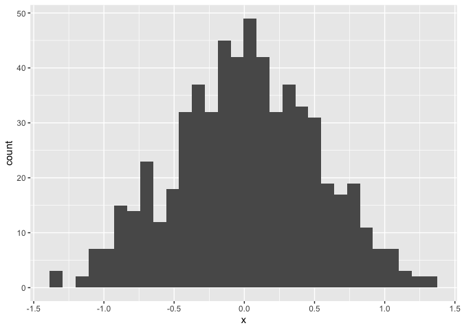

practice
================
Emma
2026-09-15

# Section 0: library

Command, option, I to make new code chunk

# Section 1: generating a sample, running a mean

``` r
sample = rnorm(600)
```

I just made a sample, and the mean is 0.0221903

# Section 2: making a new data frame

``` r
new_df=
  tibble(
    x = rnorm(600, sd = 0.5),
    y = 1 + 2 * x + rnorm(600)
  )

tail(new_df)
```

    ## # A tibble: 6 × 2
    ##         x       y
    ##     <dbl>   <dbl>
    ## 1  0.799   1.98  
    ## 2  0.569   2.63  
    ## 3  0.660  -0.0200
    ## 4 -0.0959  1.71  
    ## 5  0.283   2.59  
    ## 6 -0.408   1.18

# Section 3: I’m gonna make a plot!

``` r
ggplot(new_df, aes(x = x)) + geom_histogram()
```

    ## `stat_bin()` using `bins = 30`. Pick better value `binwidth`.

<!-- -->

The mean of this new histogram is 0.01

# Section 4: Writing Fun

## It is kind of fun

### Actually

*Now I’m just going to write a bit* **And this part is gonna be in
bold** Or will it be `code`. I can write superscripts<sup>2</sup> or
subscripts<sub>2</sub>

- I like lists
- I really do
  - I wish
  - I could write a haiku

``` r
ggplot(new_df, aes(x = x)) + geom_histogram()
```

    ## `stat_bin()` using `bins = 30`. Pick better value `binwidth`.

<!-- -->
